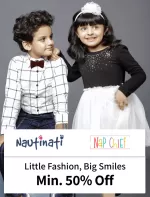

<div align="center">

# 👜 myntra-clone-html-css

### the drip, but make it *code* ✨

a front-end recreation of Myntra that's giving *aesthetic*, *responsive*, and *zero backend drama*

[](#)
[](#)
[](#)
[](#)


</div>

---

## 🛍️ what is this even

Ever looked at Myntra and thought *"I could build that"*? Same. So I did.

This is a pixel-chasing, layout-obsessing clone of the Myntra homepage — built with nothing but raw **HTML & CSS**. No frameworks holding my hand, no shortcuts. Just me, a lot of `div`s, and questionable amounts of `flexbox` at 2am.

## 🧠 the stack

no cap, kept it minimal on purpose:

| tech | why |
|---|---|
| 🧱 HTML5 | the bones |
| 🎨 CSS3 | the *whole* personality |
| 🖼️ webp images | because load speed > everything |

## ✨ what's inside

- 📱 layout that doesn't fall apart on different screens
- 🖼️ product image grid that actually looks shoppable
- 🎯 navbar + banner section that mimics the real deal
- 🧵 clean, readable code (future me will thank present me)

## 👀 preview

<div align="center">



</div>

## 🚀 run it yourself

no build tools, no `npm install`, no waiting around. it's giving *plug and play*:

```bash
git clone https://github.com/srishti-m-cmd/myntra-clone-html-css.git
cd myntra-clone-html-css
open index.html
```

that's it. that's the whole setup. 💅

## 🎯 why i built this

Cloning real-world UIs is honestly the best way to actually *get* CSS instead of just knowing it exists. Myntra's layout has enough going on — grids, spacing, typography hierarchy — to make it a solid rep for sharpening front-end fundamentals.

## 🔮 what's next

- [ ] make it fully responsive across breakpoints
- [ ] add hover interactions / micro-animations
- [ ] maybe... JavaScript? 👀 (we'll see)

## 🤝 let's connect

if you're into front-end, clones, or just want to talk CSS specificity at 2am:

<p align="left">
<a href="https://www.linkedin.com/in/srishti-m-cmd" target="_blank">

</a>
<a href="https://github.com/srishti-m-cmd" target="_blank">

</a>
</p>

---

<div align="center">

⭐ if this lowkey inspired you to clone your own fav website, drop a star

</div>
